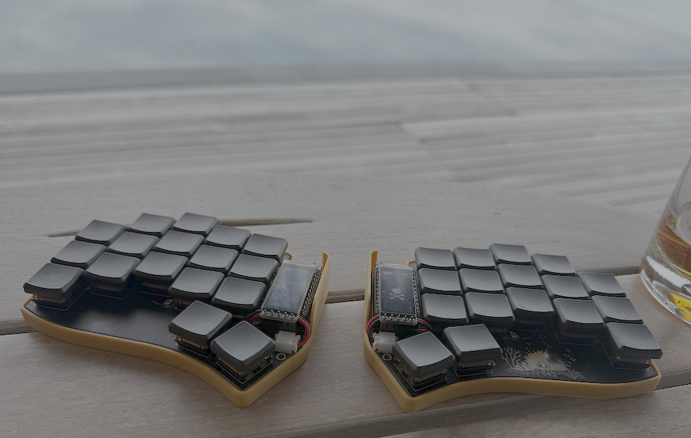

# gil

Custom configuration for the [Urchin keyboard].

## Features

* Local build — no need for GitHub actions!
* Custom artwork for the nice!view art widget in the left half
* Automated flashing

## Getting started

1. Configure your keymap in `config/gil.keymap`.
2. Configure your choice of artwork in `art/config.json`.
3. Build the firmware running `./build.sh`.
4. Flash the firmware running `./flash.sh`.

[Urchin keyboard]: https://github.com/duckyb/urchin
